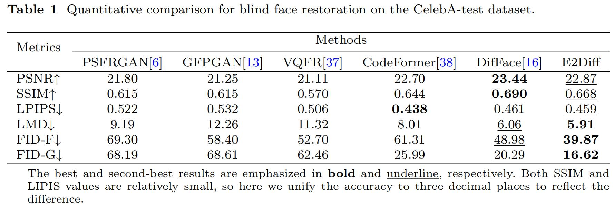

# E2Diff
Toward Blind Face Restoration with an Enhanced Efficient Diffusion Model. 


## Architecture


The overall process framework of the proposed E2Diff.


Network architecture in denoising process.

## Face Restoration


Visual comparison for blind face restoration on the CelebA-test dataset.



Quantitative comparison for blind face restoration on the CelebA-test dataset.


Visual comparison for blind face restoration on four real datasets. The qualitative results are from LFW-test, Webphoto-test, Wider-test, and CelebChild datasets from top to bottom.


Quantitative comparison of FID-F scores for blind face restoration on real datasets.


## Requirements
A suitable [conda](https://conda.io/) environment named `E2Diff` can be created and activated with:

```
conda env create -f environment.yaml
conda activate E2Diff
```
Download the pretrained models [pretrained] and [weights] (<a href="https://pan.baidu.com/s/101ngV0mwnnXJIzA47o8Cug?pwd=826u" target="_blank">Baidu</a>, 826u)

## Inference
#### :boy: Face image restoration model E2Diff (cropped and aligned)
```
python inference_difface.py -i [image folder/image path] -o [result folder] --task restoration --eta 0.5 --aligned --use_fp16
```
Note that the hyper-parameter eta controls the fidelity-realness trade-off, you can freely adjust it between 0.0 and 1.0. 
If you want to inference the lightweight model (E2Diff-L), please change the parameter into --task lightweight.  
#### :cop: Whole image enhancement
```
python inference_difface.py -i [image folder/image path] -o [result folder] --task restoration --eta 0.5 --use_fp16
```
### DPM-solver Sample
#### You can use E2Diff with DPM-solver (E2Diff-solver) with different sample step (steps = 10, 12, 15, 20, 25, 50, 100), please replace the relevant codes in sampler.py.
```
sample = dpm_solver.sample(
            yt,
            steps=15, #steps
            order=1,
            skip_type='time_quadratic',
            method="singlestep",
            # method="multistep",
            solver_type='dpmsolver',
        )
```
#### If you do not use DPM-Solver, please comment the DPM-solver codes and use the normal sample codes in sampler.py.

## Training
#### 1: Train diffusion model (E2Diff) 
```
python main.py --cfg_path configs/training/diffusion_ffhq512.yaml --save_dir [Logging Folder]  
```
#### 2: Train lightweight diffusion model (E2Diff-L) 
```
python main.py --cfg_path configs/training/diffusion_ffhq512-E2Diff-L.yaml --save_dir [Logging Folder]
```  
#### 3: Train diffused estimator for restoration (SwinIR) 
```
python main.py --cfg_path configs/training/swinir_ffhq512.yaml --save_dir [Logging Folder]  
```

## Acknowledgement
This project is based on DifFace (https://github.com/zsyOAOA/DifFace). Thanks for this awesome work.

## Contact
If you have any questions, please feel free to contact me via cr2008@xzmu.edu.cn.
